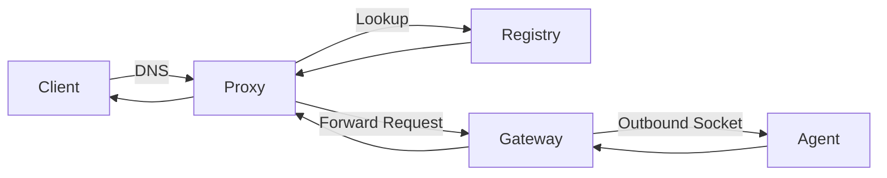

# Agnistack Ingress

> **Tunnel, route, and expose your apps — securely and simply. Built for self-hosters, edge compute, and dev teams.**

<!-- 📢 Announcement Section Start -->
## 📢 Announcement

We’re excited to share that a **new and more secure version of Agnistack** is currently in development and will be released in the coming months!  
This update will include **enhanced security**, **richer observability**, and **powerful management features** — all while staying true to our open-source roots.

Stay tuned for updates by watching this repo or following us in discord [https://discordapp.com/channels/1273907702355066961/1393671943286165665](#).
<!-- 📢 Announcement Section End -->

Agnistack is a lightweight, self-hostable, distributed ingress platform that lets you expose services running behind NAT/firewalls using outbound tunnels — without port forwarding, complex VPNs, or cloud lock-in.

This is the **Open Source Core** of Agnistack — a minimal but working version designed for developers and builders.

---

Agnistack is a lightweight, self-hostable, distributed ingress platform that lets you expose services running behind NAT/firewalls using outbound tunnels — without port forwarding, complex VPNs, or cloud lock-in.

This is the **Open Source Core** of Agnistack — a minimal but working version designed for developers and builders.

---

## ✨ Features (Open Source Edition)

✅ Self-hosted reverse proxy layer  
✅ Subdomain-based routing  
✅ Distributed proxy-to-gateway routing via registry  
✅ Secure outbound agent socket tunnel  
✅ Unified agent lifecycle  
✅ Works behind NAT/firewalls  

---

## ❗ What’s Not Included (Yet)

This OSS release is intentionally minimal. Features below are in development and will be included in the full platform:

🚫 Health checks for gateways/proxies  
🚫 Dynamic router discovery  
🚫 Integrated observability (tracing, logs, metrics)  
🚫 Web dashboard / UI  
🚫 Agent RBAC / ACL policies  
🚫 Auto TLS / DNS sync  

<!-- Want early access to the full version? [Join our waitlist](#) or follow [@agnistack](#) for updates. -->

---

## 📦 Architecture Overview



---

## 🚀 How to Start the Services

### Prerequisites

- Go 1.21 or later
- Redis server running on `localhost:6379` (or configure `REDIS_ADDR` and `REDIS_PASSWORD` environment variables)

### 1. Start Redis (Registry/Cache)

The proxy service requires Redis for routing registry and caching:

```bash
# Using Docker
docker run -d -p 6379:6379 redis:alpine

# Or using a local Redis installation
redis-server
```

### 2. Start the Proxy Service

The proxy handles incoming requests and routes them to the appropriate gateway:

```bash
cd indraNet/proxy
go run main.go
```

**Default port**: `80`

### 3. Start the Gateway Tunnel Service

The gateway manages WebSocket connections from agents and serves HTTP requests:

```bash
cd indraNet/tunnel/gateway-tunnel
go run main.go
```

**Default ports**: 
- `8080` - HTTP server for gateway management
- `50051` - WebSocket server for agent connections

### 4. Start the Agent Tunnel

The agent establishes a secure tunnel to the gateway and forwards traffic to your local service:

```bash
cd indraNet/tunnel/agent-tunnel
go run main.go connect --gateway localhost:50051 --id app1 --secret abc --token xyz --port 5000
```

**Parameters**:
- `--gateway`: Gateway WebSocket URL (e.g., `localhost:50051`)
- `--id`: Unique agent identifier
- `--secret`: HMAC secret key for authentication
- `--token`: Authentication token
- `--port`: Local port to forward (where your application is running)

### 5. Testing the Setup

Once all services are running:

1. Make sure your application is running on the port specified in the agent (e.g., port 5000)
2. Configure DNS/hosts to point your domain to the proxy (port 80)
3. Test connectivity through the tunnel

### Service Dependencies

```
Redis (Registry) <-- Proxy <-- Gateway <-- Agent <-- Your App
```

### Environment Variables

- `REDIS_ADDR` - Redis server address (default: `localhost:6379`)
- `REDIS_PASSWORD` - Redis password (default: empty)

### Development Notes

- The proxy runs on port 80 and requires appropriate permissions
- All services support graceful shutdown with `Ctrl+C`
- Logs are written to stdout for debugging
