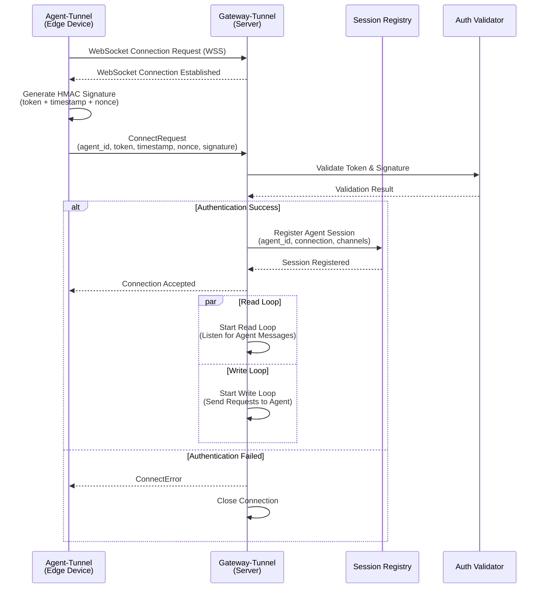
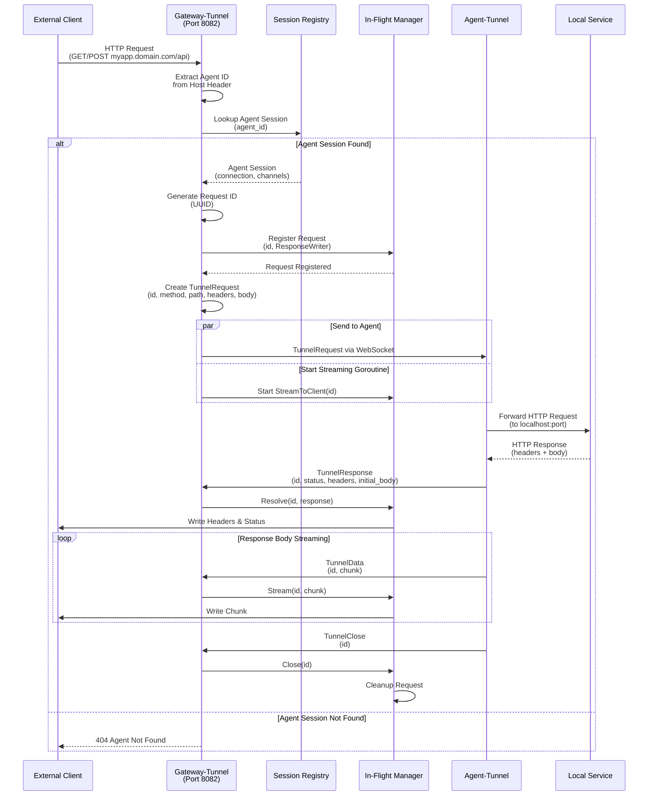
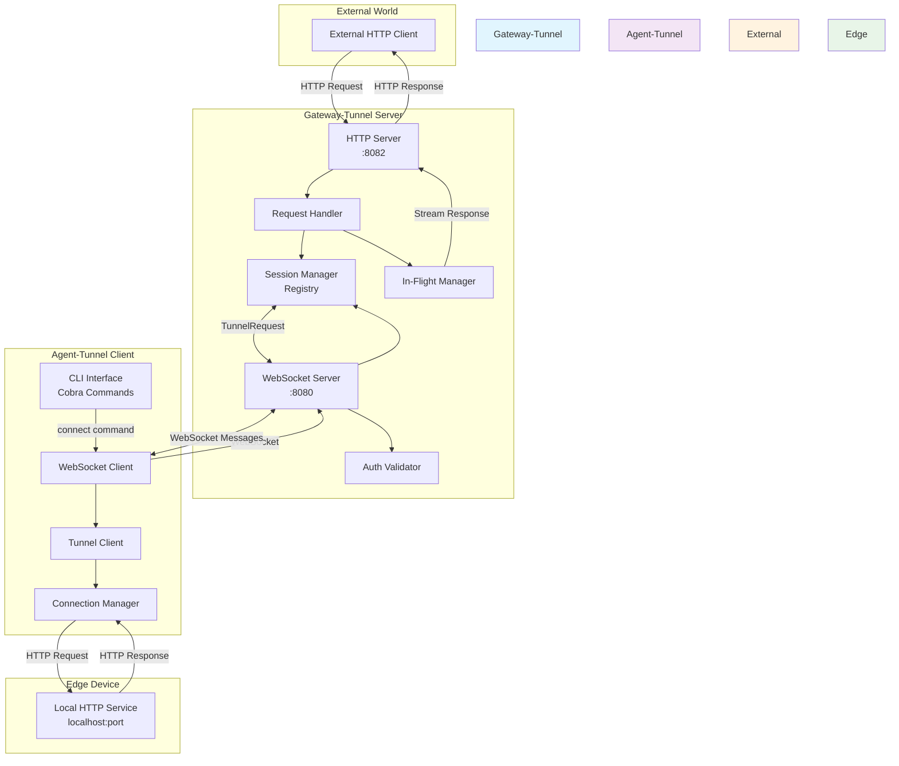
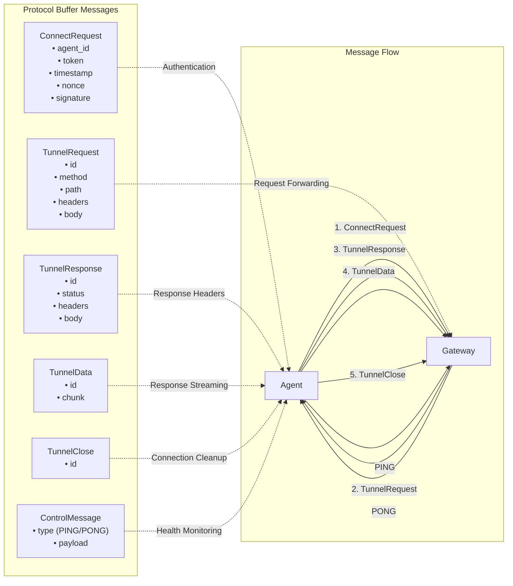
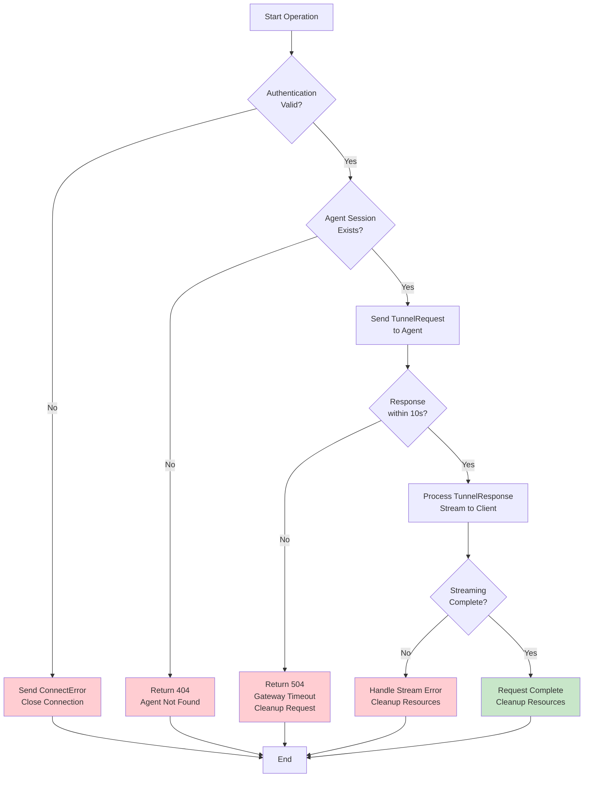
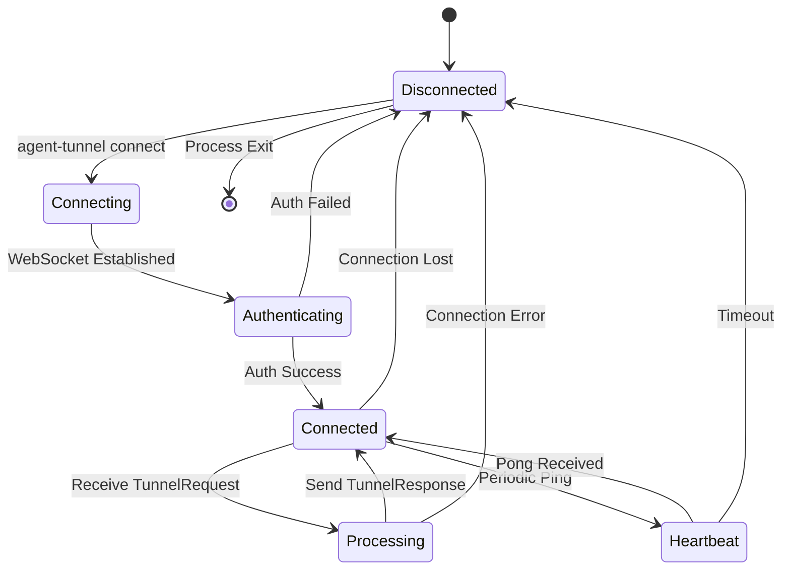

# indraNet Ingress-Tunnel - System Flow Diagram

## Complete System Flow Visualization

### 1. Agent Connection Establishment Flow

### 2. HTTP Request Processing Flow

### 3. Detailed Component Interaction Flow

### 4. Message Flow Architecture

### 5. Error Handling Flow

### 6. Connection Lifecycle Management

## Key Flow Characteristics

### Performance Characteristics
- **Concurrent Processing**: Each request handled in separate goroutine
- **Streaming Support**: Chunked response streaming for large payloads
- **Connection Pooling**: WebSocket connection reuse for multiple requests
- **Request Correlation**: UUID-based request/response matching

### Reliability Features
- **Timeout Management**: 10-second request timeout
- **Connection Health**: Periodic heartbeat monitoring
- **Graceful Shutdown**: Proper resource cleanup on disconnection
- **Error Recovery**: Comprehensive error handling at each layer

### Security Features
- **HMAC Authentication**: Cryptographic request signing
- **TLS Encryption**: End-to-end encrypted communication
- **Request Isolation**: Each request processed independently
- **Session Validation**: Continuous session state monitoring

This flow diagram provides a comprehensive view of how the indraNet ingress-tunnel system operates, from initial connection establishment through request processing and error handling.
