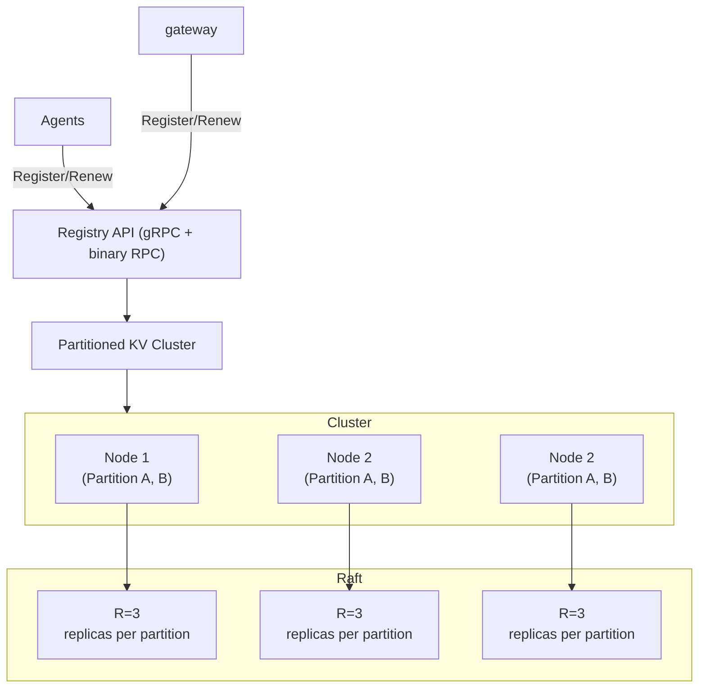

# AgniStack Registry Service Technical Planning Document

## Objective

Design and implement a highly available, ultra-low-latency registry service responsible for maintaining real-time state and connection metadata of all agents and gateways in the AgniStack ecosystem.
This service will act as the single source of truth for component discovery and routing decisions, enabling proxies and controllers to resolve live endpoint details with minimal latency and maximal consistency.

**System Defination**
- **Read-dominant**: 95–99% of operations are reads.
- **Write-minimal**: Writes limited to registration, renewal, and state updates.
- **Horizontally scalable**: Adding nodes increases read throughput linearly.
- **Highly available**: Operates with no single point of failure.
- **Predictably low-latency**: p50 read < 200µs, p99 read < 2ms in local DC.

## Background and Current Limitations
Current implementation uses Redis directly accessed by gateways and agents
- Agents and gateways push connection data directly to Redis.
- Proxy layer fetches connection data from Redis at runtime.

Problem with this model

1. Direct connection model is unscalable every agent/gateway holds a live Redis client.
2. Redis introduces single-threaded bottlenecks under heavy read load.
3. Redis cluster replication increases latency; linearizability guarantees are weak.
4. No control each component writes arbitrarily; consistency is weak.
5. Memory caching within components breaks consistency guarantees and complicates scaling

Hence, Redis is not suitable as the long-term backbone of AgniStack’s registry layer.

## Design Overview

The **Central Registry Service (CRS)** will replace direct Redis interactions with a purpose-built distributed in-memory metadata store that exposes a clean, low-latency gRPC interface for reads and writes.

### **Core Properties**

| 🏷️ **Property** | 🎯 **Target** |
| :---------------------------- | :-------------------------------------- |
| ⏱️ **Latency (p50 read)** | < **5 ms** |
| ⏱️ **Latency (p99 read)** | < **12 ms** |
| ✍️ **Write latency** | < **50 ms** |
| 🔁 **Read availability** | **99.99%** |
| 📦 **Replication factor** | **3** |
| ⚖️ **Consistency** | **Strong** *(leader lease reads)* |
| 🕒 **Staleness (if configured)** | ≤ **100 ms** *(optional stale reads)* |

## High-Level Architecture

### **Components**

1. **Registry API Layer** — Stateless gRPC front-end responsible for routing requests to partition leaders.  
2. **Partition Nodes** — Each node stores one or more partitions in-memory, handling both reads and writes.  
3. **Replication & Consensus** — Each partition is replicated across `R` nodes via Raft consensus groups.  
4. **Proxy Clients** — AgniStack proxies query the registry via local partition routing (no direct Redis).  

---
